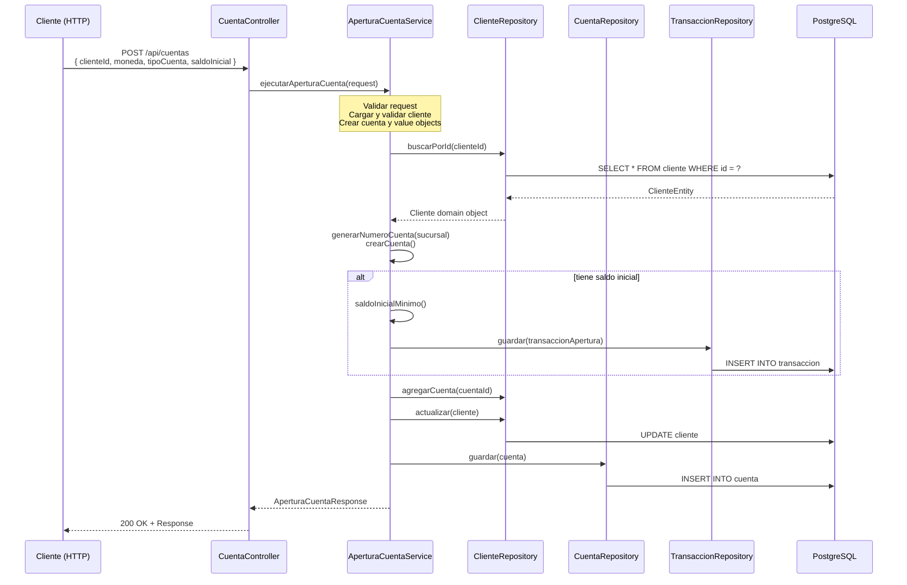
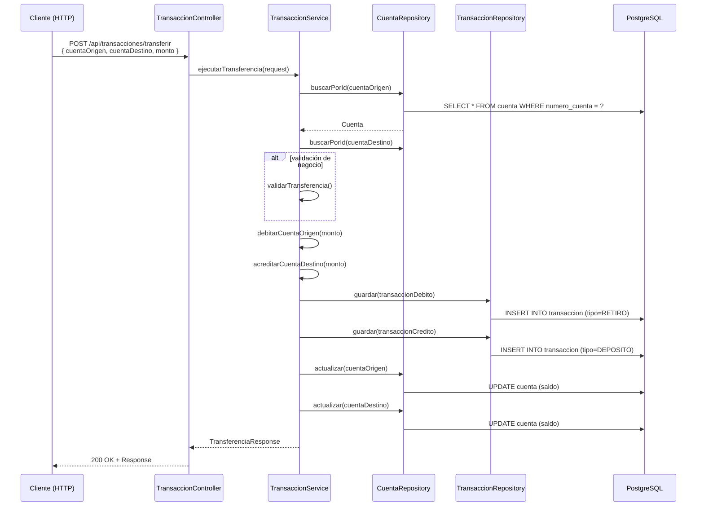

# 🏗️ Architecture: Sistema Bancario Digital

**Guardar en:** `.quinoto-spec/discovery/02-architecture.md`

---

## 📐 Visión General de Arquitectura

El proyecto implementa **Clean Architecture (Arquitectura Hexagonal)** con separación estricta de responsabilidades:

```
┌─────────────────────────────────────────────────────────────────┐
│                     PRESENTATION LAYER                          │
│  (Controllers REST: Cliente, Cuenta, Transaccion, Auth)       │
└─────────────────────────────────────────────────────────────────┘
                              │
                              ▼
┌─────────────────────────────────────────────────────────────────┐
│                     APPLICATION LAYER                           │
│  (Services: AperturaCuenta, Transaccion, ConsultaSaldo, etc.) │
│  (DTOs: Request/Response objects)                               │
│  (Ports: Interfaces de repositorio - ClienteRepository, etc.)  │
└─────────────────────────────────────────────────────────────────┘
                              │
                              ▼
┌─────────────────────────────────────────────────────────────────┐
│                       DOMAIN LAYER                              │
│  (Entities: Cliente, Cuenta, Transaccion)                      │
│  (Value Objects: Dinero, ClienteId, CuentaId, Moneda, etc.)    │
└─────────────────────────────────────────────────────────────────┘
                              │
                              ▼
┌─────────────────────────────────────────────────────────────────┐
│                   INFRASTRUCTURE LAYER                          │
│  (JpaRepository implementations, Mappers, Security JWT)       │
└─────────────────────────────────────────────────────────────────┘
```

---

## 🔄 Diagrama de Secuencia: Flujo de Apertura de Cuenta



---

## 🔄 Diagrama de Secuencia: Transferencia entre Cuentas



---

## 🧩 Componentes Principales

### Controllers (Presentation)
| Controller | Responsabilidad | Endpoints Base |
|------------|-----------------|----------------|
| `ClienteController` | CRUD de clientes, asociación de cuentas | `/api/clientes` |
| `CuentaController` | Apertura, cierre, consulta de saldo | `/api/cuentas` |
| `TransaccionController` | Depósitos, retiros, transferencias | `/api/transacciones` |
| `AuthController` | Login y registro de usuarios | `/auth` |

### Services (Application)
| Service | Propósito |
|---------|-----------|
| `AperturaCuentaService` | Crear y cerrar cuentas bancarias |
| `TransaccionService` | Transferencias, depósitos, retiros, reversión |
| `ConsultaSaldoService` | Consulta de saldo de cuentas |
| `GestionClienteService` | CRUD completo de clientes |
| `AuthService` | Autenticación JWT, registro de usuarios |
| `UsersDetailsService` | Carga de usuario para Spring Security |

### Repositories (Ports - Interface)
- `ClienteRepository` - Interface para operaciones de cliente
- `CuentaRepository` - Interface para operaciones de cuenta
- `TransaccionRepository` - Interface para operaciones de transacción

### Domain Entities
| Entity | Propósito |
|--------|-----------|
| `Cliente` | Representa cliente del banco (con validaciones de negocio) |
| `Cuenta` | Representa cuenta bancaria con saldo y estado |
| `Transaccion` | Representa operación financiera |

### Value Objects
| Value Object | Propósito |
|--------------|-----------|
| `Dinero` | Inmutable, representa montos con moneda |
| `ClienteId` | Identificador de cliente |
| `CuentaId` | Identificador de cuenta (con validación de formato) |
| `TransaccionId` | Identificador de transacción (formato TXN-AAAA-NNNNNNN) |
| `Moneda` | Enumeración de tipos de moneda (ARS, USD) |
| `TipoCuenta` | Enumeración de tipos de cuenta (AHORRO, CORRIENTE) |

---

## 🔗 Integraciones

### Interna
- **Spring Security + JWT**: Autenticación basada en tokens
- **Spring Data JPA**: Persistencia con Hibernate
- **SpringDoc OpenAPI**: Documentación automática de API

### Externa
- **PostgreSQL 17**: Base de datos relacional (contenedor Docker)

---

## 📦 Librerías y Frameworks

| Librería | Versión | Propósito |
|----------|---------|-----------|
| Spring Boot | 3.5.7 | Framework principal |
| Spring Security | (incluido) | Seguridad |
| Spring Data JPA | (incluido) | ORM |
| jjwt | 0.11.5 | Tokens JWT |
| springdoc-openapi | 2.8.6 | Swagger/OpenAPI |
| Lombok | (incluido) | Reducción de boilerplate |

---

## 🏛️ Patrones de Diseño Detectados

1. **Dependency Injection** - Constructor injection en todos los servicios
2. **Repository Pattern** - Interfaces en Application layer, implementaciones en Infrastructure
3. **Service Layer** - Lógica de negocio encapsulada
4. **Value Objects** - Inmutabilidad para tipos complejos (Dinero, IDs)
5. **DTO Pattern** - Separación entre dominio y presentación
6. **Transaction Script** - Servicios orquestan operaciones