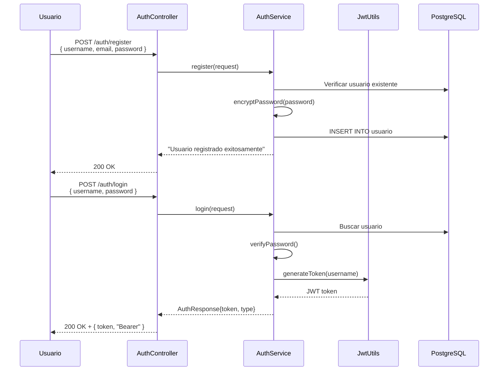

# 🌐 Endpoints and OpenAPI: Sistema Bancario Digital

**Guardar en:** `.quinoto-spec/discovery/03-endpoints-and-openapi.md`

---

## 📋 Resumen de Endpoints REST

| Método | Endpoint | Descripción | Autenticación |
|--------|----------|-------------|---------------|
| POST | `/auth/register` | Registrar nuevo usuario | No |
| POST | `/auth/login` | Iniciar sesión | No |
| POST | `/api/clientes` | Crear cliente | JWT |
| GET | `/api/clientes/{id}` | Obtener cliente por ID | JWT |
| PUT | `/api/clientes/{id}` | Actualizar cliente | JWT |
| DELETE | `/api/clientes/{id}` | Desactivar cliente | JWT |
| POST | `/api/clientes/{id}` | Activar cliente | JWT |
| GET | `/api/clientes/{id}/cuenta` | Obtener cuentas del cliente | JWT |
| POST | `/api/clientes/{clienteId}/cuenta/{cuentaId}` | Agregar cuenta a cliente | JWT |
| DELETE | `/api/clientes/{clienteId}/cuenta/{cuentaId}` | Eliminar cuenta de cliente | JWT |
| POST | `/api/cuentas` | Abrir nueva cuenta | JWT |
| GET | `/api/cuentas` | Consultar saldo | JWT |
| DELETE | `/api/cuentas/{cuentaStringId}` | Cerrar cuenta | JWT |
| POST | `/api/cuentas/{cuentaStringId}` | Re-abrir cuenta | JWT |
| POST | `/api/transacciones/transferir` | Transferencia entre cuentas | JWT |
| POST | `/api/transacciones/deposito` | Depósito a cuenta | JWT |
| POST | `/api/transacciones/retiro` | Retiro de cuenta | JWT |
| POST | `/api/transacciones/{transaccionId}/revertir` | Revertir transacción | JWT |
| GET | `/api/transacciones/{cuentaStringId}/movimientos` | Ver movimientos | JWT |

---

## 🔐 Autenticación y Autorización

### Sistema JWT
- **Proveedor**: `io.jsonwebtoken` v0.11.5
- **Filtro**: `JwtAuthenticationFilter` en cadena de seguridad
- **Utils**: `JwtUtils` para generación y validación de tokens

### Configuración (SecurityConfig)
- Endpoints `/auth/**` públicos
- Resto de endpoints requieren token JWT válido
- Roles: Pendiente de revisar implementación de RBAC

### Flujo de Autenticación



---

## 📄 OpenAPI Specification (Swagger)

### Generada automáticamente
- **URL Swagger UI**: `http://localhost:8080/swagger-ui/index.html`
- **URL OpenAPI JSON**: `http://localhost:8080/v3/api-docs`

### Especificación OpenAPI Detectable

```yaml
openapi: 3.0.3
info:
  title: Sistema Bancario Digital API
  version: 1.0.0
  description: API REST para gestión de operaciones bancarias

servers:
  - url: http://localhost:8080

paths:
  /auth/login:
    post:
      tags:
        - Authentication
      summary: Iniciar sesión
      requestBody:
        content:
          application/json:
            schema:
              $ref: '#/components/schemas/LoginRequest'
      responses:
        '200':
          description: Login exitoso
          content:
            application/json:
              schema:
                $ref: '#/components/schemas/AuthResponse'

  /api/clientes:
    post:
      tags:
        - Clientes
      summary: Crear nuevo cliente
      security:
        - bearerAuth: []
      requestBody:
        content:
          application/json:
            schema:
              $ref: '#/components/schemas/ClienteRequest'
      responses:
        '201':
          description: Cliente creado
          content:
            application/json:
              schema:
                $ref: '#/components/schemas/ClienteResponse'

  /api/cuentas:
    post:
      tags:
        - Cuentas
      summary: Abrir cuenta bancaria
      security:
        - bearerAuth: []
      requestBody:
        content:
          application/json:
            schema:
              $ref: '#/components/schemas/AperturaCuentaRequest'
      responses:
        '200':
          description: Cuenta abierta exitosamente

  /api/transacciones/transferir:
    post:
      tags:
        - Transacciones
      summary: Transferencia entre cuentas
      security:
        - bearerAuth: []
      requestBody:
        content:
          application/json:
            schema:
              $ref: '#/components/schemas/TransferenciaRequest'
      responses:
        '200':
          description: Transferencia exitosa

components:
  securitySchemes:
    bearerAuth:
      type: http
      scheme: bearer
      bearerFormat: JWT

  schemas:
    LoginRequest:
      type: object
      properties:
        username:
          type: string
        password:
          type: string

    AuthResponse:
      type: object
      properties:
        token:
          type: string
        type:
          type: string

    ClienteRequest:
      type: object
      properties:
        nombre:
          type: string
        email:
          type: string
        dni:
          type: string

    AperturaCuentaRequest:
      type: object
      properties:
        clienteId:
          type: string
        tipoCuenta:
          type: string
        moneda:
          type: string
        saldoInicial:
          type: number

    TransferenciaRequest:
      type: object
      properties:
        cuentaOrigen:
          type: string
        cuentaDestino:
          type: string
        monto:
          type: number
```

---

## 💡 Ejemplos de Request/Response

### POST /auth/login

**Request:**
```json
{
  "username": "juanperez",
  "password": "password123"
}
```

**Response:**
```json
{
  "token": "eyJhbGciOiJIUzI1NiIsInR5cCI6IkpXVCJ9...",
  "type": "Bearer"
}
```

### POST /api/clientes

**Request:**
```json
{
  "nombre": "Juan Pérez",
  "email": "juanperez@email.com",
  "dni": "12345678"
}
```

**Response:**
```json
{
  "clienteId": "CLI-2026-0000001",
  "nombre": "Juan Pérez",
  "email": "juanperez@email.com",
  "activa": true,
  "cuentaIds": []
}
```

### POST /api/cuentas

**Request:**
```json
{
  "clienteId": "CLI-2026-0000001",
  "tipoCuenta": "AHORRO",
  "moneda": "ARS",
  "saldoInicial": 1000.00,
  "sucursal": "001"
}
```

**Response:**
```json
{
  "numeroCuenta": "ARG017001000123458",
  "clienteId": "CLI-2026-0000001",
  "tipoCuenta": "AHORRO",
  "moneda": "ARS",
  "saldoInicial": 1000.00,
  "fechaCreacion": "2026-04-08T10:30:00",
  "mensaje": "Cuenta ARG017001000123458 creada exitosamente para Juan Pérez. Saldo inicial: $1000"
}
```

### POST /api/transacciones/transferir

**Request:**
```json
{
  "cuentaOrigen": "ARG017001000123458",
  "cuentaDestino": "ARG017001000987654",
  "monto": 500.00
}
```

**Response:**
```json
{
  "transaccionId": "TXN-2026-0000001",
  "cuentaOrigen": "ARG017001000123458",
  "cuentaDestino": "ARG017001000987654",
  "monto": 500.00,
  "estado": "COMPLETADA",
  "fecha": "2026-04-08T10:35:00"
}
```

---

## 🔍 Notas sobre Validación y Errores

### GlobalExceptionHandler detectado
- Manejo centralizado de excepciones
- Respuestas de error estandarizadas con `ErrorResponseDTO`

### Validaciones implementadas
- `@Valid` en todos los request bodies
- Bean Validation (Jakarta) para validación de campos
- Validaciones de negocio en servicios (cliente activo, saldo mínimo, etc.)

---

## 🧪 Recomendaciones para Pruebas de Integración

1. **Usar Testcontainers** para PostgreSQL en tests de integración
2. **Mockear** dependencias externas en tests unitarios
3. **Probar flujos completos**:
   - Registro → Login → Crear Cliente → Abrir Cuenta → Transferir
4. **Validar códigos de error**:
   - 400: Bad Request (validaciones)
   - 401: Unauthorized (sin token)
   - 404: Not Found (recurso no existe)
   - 500: Internal Server Error

### Herramientas sugeridas
- **Postman/Newman** para colección de tests
- **RestAssured** para tests de integración Java
- **MockMvc** para tests de controladores (ya implementado)