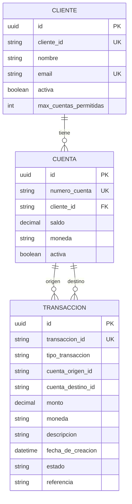

# 💾 Data and Services: Sistema Bancario Digital

**Guardar en:** `.quinoto-spec/discovery/04-data-and-services.md`

---

## 📊 Modelo de Datos

### Esquema de Base de Datos (PostgreSQL)

#### Tabla: `clientes`
| Columna | Tipo | Restricciones | Descripción |
|---------|------|----------------|-------------|
| `id` | UUID | PK, auto-generado | ID interno |
| `cliente_id` | VARCHAR(50) | UNIQUE, NOT NULL | Identificador público del cliente |
| `nombre` | VARCHAR(100) | NOT NULL | Nombre completo |
| `email` | VARCHAR(50) | UNIQUE, NOT NULL | Correo electrónico |
| `activa` | BOOLEAN | NOT NULL, DEFAULT true | Estado del cliente |
| `max_cuentas_permitidas` | INT | NOT NULL, DEFAULT 5 | Límite de cuentas |

#### Tabla Relación: `cliente_cuentas`
| Columna | Tipo | Descripción |
|---------|------|-------------|
| `cliente_entity_id` | UUID | FK a clientes |
| `cuentas_Ids` | VARCHAR | ID de cuenta asociada |

#### Tabla: `cuentas`
| Columna | Tipo | Restricciones | Descripción |
|---------|------|----------------|-------------|
| `id` | UUID | PK, auto-generado | ID interno |
| `numero_cuenta` | VARCHAR(30) | UNIQUE, NOT NULL | Número de cuenta (formato: ARG-XXX-XXX-XXXXXXXX-X) |
| `cliente_id` | VARCHAR(50) | NOT NULL | FK a cliente |
| `saldo` | DECIMAL(15,2) | NOT NULL | Saldo actual |
| `moneda` | VARCHAR(3) | NOT NULL | Moneda (ARS, USD) |
| `activa` | BOOLEAN | NOT NULL | Estado de la cuenta |

#### Tabla: `transacciones`
| Columna | Tipo | Restricciones | Descripción |
|---------|------|----------------|-------------|
| `id` | UUID | PK, auto-generado | ID interno |
| `transaccion_id` | VARCHAR(60) | UNIQUE, NOT NULL | ID público (formato: TXN-AAAA-NNNNNNN) |
| `tipo_transaccion` | VARCHAR(20) | NOT NULL | DEPOSITO, RETIRO, TRANSFERENCIA |
| `cuenta_origen_id` | VARCHAR(50) | Nullable | Cuenta que débito |
| `cuenta_destino_id` | VARCHAR(50) | Nullable | Cuenta que acredita |
| `monto` | DECIMAL(15,2) | NOT NULL | Monto de la operación |
| `moneda` | VARCHAR(3) | NOT NULL | Moneda de la operación |
| `descripcion` | VARCHAR(200) | Nullable | Descripción adicional |
| `fecha_de_creacion` | TIMESTAMP | NOT NULL | Fecha de creación |
| `estado` | VARCHAR(20) | NOT NULL | PENDIENTE, COMPLETADA, RECHAZADA, REVERTIDA |
| `referencia` | VARCHAR(100) | Nullable | Referencia externa |

---

## 🔗 Diagrama ER



---

## 🏗️ Value Objects y Enums

### Moneda
```java
public enum Moneda {
    ARS,  // Peso Argentino
    USD   // Dólar Estadounidense
}
```

### TipoCuenta
```java
public enum TipoCuenta {
    AHORRO,
    CORRIENTE
}
```

### TipoTransaccion
```java
public enum TipoTransaccion {
    DEPOSITO,
    RETIRO,
    TRANSFERENCIA
}
```

### EstadoTransaccion
```java
public enum EstadoTransaccion {
    PENDIENTE,
    COMPLETADA,
    RECHAZADA,
    REVERTIDA
}
```

---

## 🧩 Servicios Externos

### Integraciones Detectadas

| Servicio | Propósito | Estado |
|----------|-----------|--------|
| **PostgreSQL 17** | Base de datos relacional | ✅ Implementado |
| **Spring Security** | Autenticación JWT | ✅ Implementado |
| **SpringDoc OpenAPI** | Documentación API | ✅ Implementado |

### No se detectaron integraciones externas con:
- APIs de terceros (西南支付, SWIFT, etc.)
- Servicios cloud (AWS, GCP, Azure)
- Brokers de mensajería
- Servicios de notificación (email, SMS)

---

## 💉 Inyección de Dependencias

### Servicios Principales

```java
@Service
@Transactional
public class AperturaCuentaService {
    private final ClienteRepository clienteRepository;
    private final CuentaRepository cuentaRepository;
    private final TransaccionRepository transaccionRepository;
    
    public AperturaCuentaService(ClienteRepository, CuentaRepository, TransaccionRepository) { ... }
}
```

### Repositorios (Ports)

```java
public interface ClienteRepository {
    Cliente buscarPorId(String clienteId);
    void actualizar(Cliente cliente);
    // ...
}
```

### Implementaciones (Infrastructure)

```java
@Repository
public class ClienteRepositoryJpa implements ClienteRepository {
    @Autowired
    private ClienteJpaRepository jpaRepository;
    // ...
}
```

---

## 📜 Scripts de Migración y Seeds

**Estado:** No se detectaron scripts de migración (Flyway, Liquibase) ni archivos SQL de seeds.

### Recomendaciones

1. **Agregar Flyway** para control de versiones de BD:
   ```xml
   <dependency>
       <groupId>org.flywaydb</groupId>
       <artifactId>flyway-core</artifactId>
   </dependency>
   ```

2. **Crear scripts de migración** en `src/main/resources/db/migration/`:
   - `V1__create_tables.sql`
   - `V2__seed_initial_data.sql`

3. **Alternativa**: Usar `data.sql` de Spring Boot para datos iniciales.

---

## 🔄 Cómo Ejecutar Scripts de Datos

### Opción 1: Spring Boot data.sql
Colocar en `src/main/resources/data.sql` (se ejecuta automáticamente al iniciar).

### Opción 2: Flyway
Agregar dependencia y crear scripts en `src/main/resources/db/migration/`.

### Opción 3: Manual
```bash
# Conectar a PostgreSQL
psql -h localhost -U postgres -d banco_db

# Ejecutar script
\i schema.sql
\i seed.sql
```

---

## 📁 Estructura de Acceso a Datos

```
src/main/java/com/banco/
├── application/port/out/
│   ├── ClienteRepository.java
│   ├── CuentaRepository.java
│   └── TransaccionRepository.java
├── infrastructure/persistence/
│   ├── jpa/
│   │   ├── ClienteRepositoryJpa.java
│   │   ├── CuentaRepositoryJpa.java
│   │   └── TransaccionRepositoryJpa.java
│   ├── entities/
│   │   ├── ClienteEntity.java
│   │   ├── CuentaEntity.java
│   │   └── TransaccionEntity.java
│   └── mappers/
│       ├── ClienteMapper.java
│       ├── CuentaMapper.java
│       └── TransaccionMapper.java
```

---

## ⚠️ Notas Importantes

1. **Sin migraciones formales**: El esquema se genera automáticamente desde las entidades JPA (`spring.jpa.hibernate.ddl-auto` probablemente en `create` o `update`).

2. **Sin datos iniciales**: No hay seeds para datos de prueba.

3. **IDs con formato personalizado**: 
   - Cliente: `CLI-AAAA-NNNNNNN`
   - Cuenta: `ARGXXX-XXX-XXXXXXXX-X`
   - Transacción: `TXN-AAAA-NNNNNNN`

4. **Límite de cuentas hardcodeado**: 5 cuentas máximo por cliente (configurable en código).