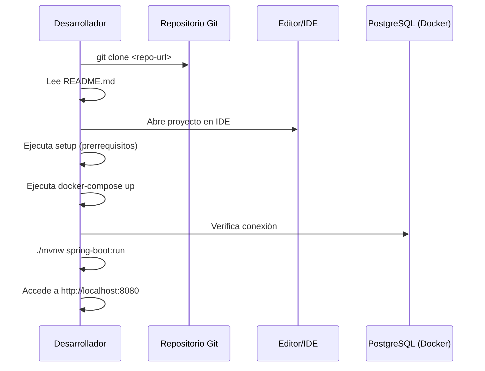

# Propuesta Técnica: Project Documentation README

**Prefijo:** DOCU
**Fecha de Creación**: 2026-04-08
**Estado**: ✅ Completada
**Prioridad**: P3
**Complejidad**: Baja
**Servicios Afectados**: Proyecto completo (documentación)

---

## Resumen Ejecutivo

Esta propuesta tiene como objetivo crear un archivo `README.md` con la documentación básica del proyecto Sistema Bancario Digital. El documento proporcionará una visión general del proyecto, instrucciones de setup, estructura del proyecto y comandos útiles para desarrolladores que recien se integren al equipo.

## Problema Actual

1. **Falta de documentación de onboarding**: No existe un punto de entrada claro para nuevos desarrolladores.
2. **Sin instructions de setup**: Los contribuidores no tienen guía para configurar el entorno local.
3. **Desconocimiento de estructura**: Dificultad para entender la arquitectura del proyecto sin revisar código.
4. **Sin comandos útiles centralizados**: Los desarrolladores deben buscar en múltiples lugares cómo ejecutar tareas comunes.

## Alternativas Consideradas

| Alternativa | Pros | Contras | Descartada porque |
|-------------|------|---------|-------------------|
| Wiki en repositorio | Centralizado, colaborativo | Requiere mantenimiento extra | Mantenimiento adicional |
| Documentación en Confluence | Herramienta profesional | Requiere licencia, fuera del repo | No está en el repo |
| README.md en raíz | Visible al clonar, siempre actualizado | Limitado en formato | **Elegida** |

## Solución Propuesta

Crear un archivo `README.md` en la raíz del proyecto con:

1. Título y descripción del proyecto
2. Badges de estado (build, tests, tecnología)
3. Tabla de contenidos
4. Getting Started (prerrequisitos, instalación, configuración)
5. Estructura del proyecto con árbol de directorios
6. Comandos útiles (dev, build, test, docker)
7. Configuración de variables de entorno
8. API Endpoints principales
9. Contributing guidelines
10. Licencia

## Beneficios

- **Tiempo**: Reduce ~30 min el tiempo de onboarding de nuevos desarrolladores
- **Calidad**: Estandariza la forma de trabajo del proyecto
- **DX (Developer Experience)**: Mejora la experiencia al contribuir al proyecto
- **Negocios**: Facilita la incorporación de nuevos miembros al equipo

## Alineación con Producto y Acuerdos

### Visión de Producto
El proyecto forma parte del sistema de gestión bancaria digital. El README documentación la base técnica que soporta las operaciones financieras.

### KPIs Impactados
- **Tiempo de apertura de cuenta**: N/A (docs)
- **Disponibilidad del servicio**: N/A (docs)
- **Tiempo de respuesta de API**: N/A (docs)
- **Tasa de transacciones exitosas**: N/A (docs)

### Cumplimiento de DoR
| Criterio DoR | Estado |
|--------------|--------|
| Criteria de aceptación definidos | ✅ |
| Diseño técnico revisado | ✅ |
| Dependencias identificadas | ✅ (sin nuevas deps) |
| Datos de prueba definidos | N/A |
| Estimación de esfuerzo acordada | ✅ |
| Criterios de security review | N/A |
| Dependencies actualizadas | ✅ |

## Arquitectura y Diseño Técnico

### Diagrama de Secuencia (Documentación)



### Estructura del README

```
README.md
├── Project Title & Badges
├── Table of Contents
├── Description
├── Prerequisites
├── Installation
│   ├── Clone
│   ├── Configure
│   └── Run
├── Project Structure
├── Available Scripts
├── Environment Variables
├── API Endpoints
├── Testing
├── Docker
├── Contributing
└── License
```

## Especificación Técnica Detallada

### Contenido del README.md

```markdown
# Sistema Bancario Digital

[](https://www.java.com/)
[](https://spring.io/projects/spring-boot)
[](https://www.postgresql.org/)
[](LICENSE)

REST API para gestión de operaciones bancarias digitales.

## Tabla de Contenidos
1. Descripción
2. Prerrequisitos
3. Instalación
4. Estructura del Proyecto
5. Comandos Disponibles
6. Variables de Entorno
7. Endpoints API
8. Testing
9. Docker
10. Contribuir
11. Licencia

## Descripción
[...]

## Prerrequisitos
- Java 17
- Maven 3.9+
- Docker y Docker Compose

## Instalación
1. Clonar repositorio
2. Configurar variables de entorno
3. Ejecutar docker-compose up
4. Acceder a http://localhost:8080
```

### Ubicaciones y Archivos

| Archivo | Descripción |
|---------|-------------|
| `README.md` | Documentación principal |
| `.github/PULL_REQUEST_TEMPLATE.md` | Template para PRs |

## Riesgos y Mitigaciones

| Riesgo | Probabilidad | Impacto | Mitigación |
|--------|---------------|---------|------------|
| Documentación desactualizada | Media | Bajo | Revisión en cada release |
| Contenido muy extenso | Baja | Bajo | Mantener conciso,links a docs profundas |
| Duplicación con otros docs | Baja | Bajo | Referenciar,no duplicar |

## Plan de Implementación

| Fase | Descripción | Tiempo Estimado |
|------|-------------|-----------------|
| 1 | Crear estructura y secciones | 30 min |
| 2 | Añadir contenido técnico | 45 min |
| 3 | Revisar y validar | 15 min |
| **Total** | | **~1.5 horas** |

## Criterios de Aceptación (DoD)

| Criterio | Estado |
|----------|--------|
| Código implementado | ⏳ |
| Tests pasando | N/A |
| Build exitoso | ⏳ |
| Code review aprobado | ⏳ |
| Documentación actualizada | ✅ |
| Seguridad validada | N/A |
| Despliegue a staging | N/A |
| Validación funcional | ⏳ |

## Plan de Verificación

### Tests Manuales
1. Abrir `README.md` en GitHub/GitLab
2. Verificar que todos los badges cargan
3. Verificar que los enlaces internos funcionan
4. Verificar que el código de ejemplo es copy-pasteable
5. Probar cada comando documentado

### Tests Automatizados
- N/A (documentación)

### Criterio de Éxito
- README visible en la raíz del repositorio
- Todos los comandos ejecutables-verificados
- Menos de 2 clics para cualquier información clave

## Impacto en el Sistema

| Archivos Nuevos | Archivos Modificados |
|-----------------|----------------------|
| `README.md` | Ninguno |
| `.github/PULL_REQUEST_TEMPLATE.md` (opcional) | |

### Dependencias y Tooling
- Ninguna nueva

## Roadmap Futuro (Opcional)

1. Añadir guía de contribución detallada
2. Crear CHANGELOG.md
3. Añadir badges de coverage (Jacoco)
4. Documentación de arquitectura en `/docs`
5. Wiki para decisiones técnicas (ADRs)

## Conclusión

La documentación básica del proyecto es esencial para la adopción y mantenimiento a largo plazo. Un README claro y completo reduce la barrera de entrada para nuevos colaboradores y proporciona una referencia rápida para desarrolladores existentes.

---

## 📚 Documentación Relacionada

Esta propuesta se basa en la siguiente documentación del proyecto:

| Archivo | Descripción |
|---------|-------------|
| [00-stack-profile.md](../discovery/00-stack-profile.md) | Stack tecnológico completo |
| [01-overview.md](../discovery/01-overview.md) | Resumen ejecutivo y estructura |
| [02-architecture.md](../discovery/02-architecture.md) | Arquitectura Clean Architecture |
| [03-endpoints-and-openapi.md](../discovery/03-endpoints-and-openapi.md) | Endpoints REST y OpenAPI |
| [04-data-and-services.md](../discovery/04-data-and-services.md) | Modelo de datos y servicios |
| [05-devops-ci-security.md](../discovery/05-devops-ci-security.md) | DevOps y seguridad |
| [06-findings-and-recommendations.md](../discovery/06-findings-and-recommendations.md) | Hallazgos y recomendaciones |
| [07-product-and-agreements.md](../discovery/07-product-and-agreements.md) | Visión de producto y acuerdos |

---

**Documentación generada por:** Gustavo "Barba" Ghioldi con [QuinotoSpec](https://github.com/Quinoto-Tech/QuinotoSpec/), opencode + Big Pickle

**Aprobación Requerida**: Product Owner / Tech Lead  
**Estimación Total**: ~1.5 horas  
**Prioridad**: P3  
**Fecha Límite Sugerida**: 2026-04-15